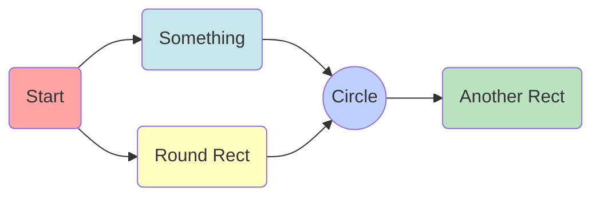

# Pete's Inventory App

Info for my **Inventory App**. 
If you want to learn about this app, keep scrolling :smiley:


## Known Bugs


```
 Markup : 1. A numbered list
              1. A nested numbered list
              2. Which is numbered
          2. Which is numbered
```


* bullet one
  * sub-bullet 1 
  * sub-bullet 2 
* bullet two  

StackEdit stores your files in your browser, which means all your files are automatically saved locally and are accessible **offline!**

> You can find more information about **LaTeX** mathematical expressions [here](http://meta.math.stackexchange.com/questions/5020/mathjax-basic-tutorial-and-quick-reference).

## Markdown extensions

StackEdit extends the standard Markdown syntax by adding extra **Markdown extensions**, providing you with some nice features.

```
function test() {
  console.log("notice the blank line before this function?");
}
```

## A Table

For example:

|                |ASCII                          |HTML                         |
|----------------|-------------------------------|-----------------------------|
|Single backticks|`'Isn't this fun?'`            |'Isn't this fun?'            |
|Quotes          |`"Isn't this fun?"`            |"Isn't this fun?"            |
|Dashes          |`-- is en-dash, --- is em-dash`|-- is en-dash, --- is em-dash|
